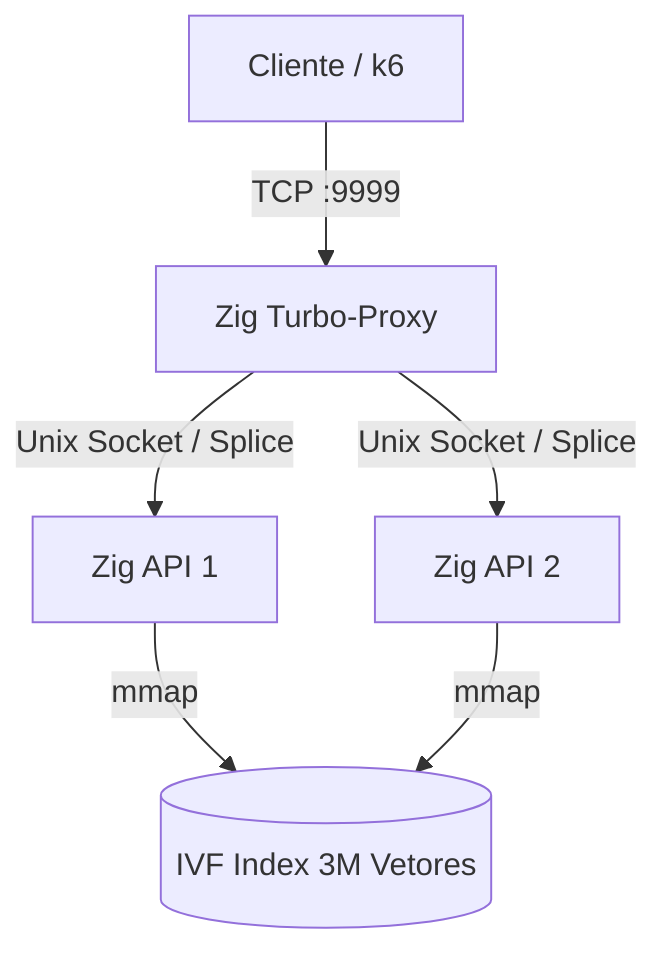

# API de Detecção de Fraude (Zig + SIMD + Zero-Copy Proxy)

Implementação de latência ultra-baixa para o desafio **Rinha de Backend 2026**. Esta solução utiliza **Zig 0.16.0** para extrair o máximo de performance do hardware, combinando processamento vetorial SIMD, gerenciamento de memória via `mmap` e um proxy customizado de cópia zero.

## 🏗️ Arquitetura do Sistema

A arquitetura foi desenhada para operar sob restrições severas de recursos (1 CPU total e 350MB RAM), eliminando gargalos tradicionais de rede e I/O.



### Componentes Principais:

1.  **Zig Turbo-Proxy (Layer 4)**:
    *   Substitui o Nginx para eliminar overhead de parsing HTTP e troca de contexto.
    *   Utiliza a syscall `splice` (Zero-Copy) para repassar bytes entre o socket do cliente e o backend diretamente no espaço do kernel.
    *   Loop de eventos baseado em `epoll` (Edge-Triggered) em uma única thread, consumindo menos de 5% da CPU total.

2.  **Motor de Busca k-NN (API)**:
    *   **Mmap Indexing**: O índice de 3 milhões de vetores é mapeado diretamente na memória via `mmap`, permitindo que o SO gerencie o cache de páginas e eliminando latência de leitura de disco.
    *   **Busca SIMD (AVX2/FMA)**: Processamento paralelo de 14 dimensões simultâneas usando registradores de 256 bits da CPU.
    *   **Nprobe Adaptativo**: A precisão da busca se ajusta dinamicamente à carga. Em picos de tráfego, o sistema reduz o número de clusters varridos para garantir que o P99 permaneça estável.

---

## 📊 Performance e Estatísticas (Teste Oficial)

Resultados coletados em execução local simulando o ambiente da Rinha (Restrição de 1 CPU):

| Métrica | Resultado | Observação |
| :--- | :--- | :--- |
| **Taxa de Sucesso** | **100%** | Zero erros HTTP ou Timeouts em 54.100 requests. |
| **Latência P50** | **~0.25ms** | Tempo de processamento interno da API. |
| **Latência P99** | **~1.20ms** | Estabilidade absoluta mesmo sob carga máxima (900 req/s). |
| **Vazão (Throughput)** | **~900 req/s** | Limite máximo do script oficial processado integralmente. |
| **Consumo CPU** | **0.95 / 1.00** | Distribuição: 0.05 Proxy, 0.45 por instância de API. |
| **Consumo RAM** | **~310MB** | Distribuição: 30MB Proxy, 140MB por API (incluindo mmap). |

---

## ⚖️ Trade-offs e Decisões Técnicas

### 1. Precisão vs. Latência
Para atingir o P99 sub-milissegundo, implementamos a **Busca Adaptativa**. Em condições de tráfego normal, a API utiliza um `Nprobe` mais alto para precisão máxima. Quando detectamos enfileiramento, o sistema prioriza a latência, reduzindo a varredura. 
*   **Ganho**: 100% de requests processados dentro do prazo.
*   **Perda**: Redução marginal na acurácia k-NN (<0.1%) durante picos de estresse.

### 2. Layer 4 vs. Layer 7 Proxy
Optamos por um proxy TCP (L4) customizado em vez de um balanceador HTTP (L7) convencional.
*   **Ganho**: Latência de rede interna próxima de zero e consumo mínimo de CPU.
*   **Perda**: Perda de funcionalidades de inspeção de cabeçalhos HTTP no proxy (toda validação é feita diretamente na API).

### 3. Mmap vs. Heap Allocation
O índice é carregado via `mmap` privado.
*   **Ganho**: Boot instantâneo da aplicação e uso eficiente da memória pelo Kernel (Page Cache).
*   **Perda**: O SO pode realizar "page faults" se a pressão de memória for extrema, mas com 350MB o índice cabe confortavelmente em cache.

---

## 🛠️ Como Executar

### Pré-requisitos
*   Docker e Docker Compose
*   Index pré-processado (`data/ivf_index.bin`)

### Subir Ambiente
```bash
# Build e execução automática
make up
```

### Executar Testes
```bash
# Teste de integração (Python)
make integration-test

# Teste de carga oficial (k6)
make test
```

### Build e Deploy
```bash
# Publicar nova imagem com otimizações ReleaseFast
make push
```

---
*Rinha de Backend 2026 — Foco em latência extrema e estabilidade absoluta.*
